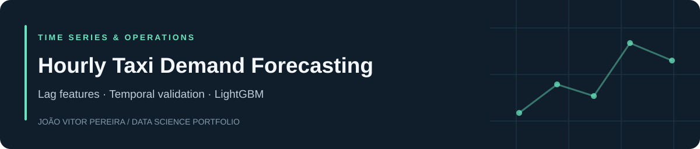

[English](README.md) · **Português** · [Portfólio](https://github.com/joaovspereira)

# Hourly Taxi Demand Forecasting

## Problema e objetivo

Prever a demanda de táxis para a próxima hora com RMSE de teste de até 48.

## Resultados documentados

LightGBM: RMSE 41,01. Random Forest: 44,05. Regressão Linear: 45,81.

## Método

Reamostragem horária, análise de tendência e sazonalidade, atributos de calendário, 24 defasagens, média móvel e TimeSeriesSplit.

## Tecnologias

Python · pandas · NumPy · statsmodels · scikit-learn · LightGBM

## Evidências e execução

- [Notebook completo](notebooks/hourly_taxi_demand_forecasting.ipynb)
- [Arquivos de dados necessários](data/README.md)
- [Dependências](requirements.txt)
- [Instruções de instalação](README.md#run-locally)

## Escopo e limitações

Resultados da execução original; os últimos 10% da série compõem o teste. Previsão de uma hora à frente com demanda anterior observada, não uma previsão recursiva de todo o horizonte. Os gráficos exploratórios incluem a série completa. As dependências não representam um ambiente histórico travado por versão.

Projeto educacional desenvolvido no Data Science Bootcamp da TripleTen. A revisão de publicação dos projetos, exceto a reexecução documentada do petróleo, verificou estrutura e sintaxe sem repetir o treinamento completo. Os datasets não são redistribuídos.

[João Vitor Pereira](https://github.com/joaovspereira) · [Contato](mailto:joaovitorsouza20pereira@gmail.com)
